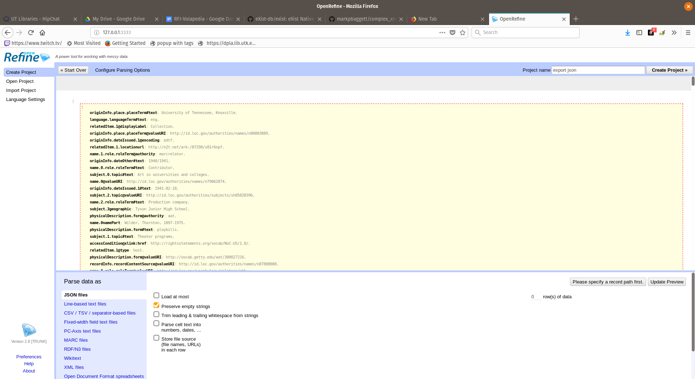
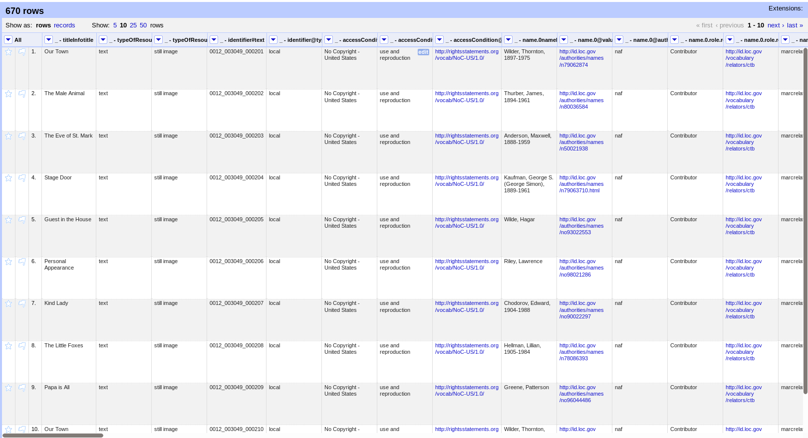

# Complex XML to OpenRefine

## About

This takes a complex XML file (or complex xml files with Batch) and generates a flat JSON, XML, or CSV file for easy 
importing into OpenRefine. Its purpose is to losslessly create an OpenRefine project based on complex XML while keeping 
all metadata in a single row while still allowing the user to semantically understand the relationships between the 
data so that it can ultimately be exported back to XML with the same relationships that existed previously.

## How to Use with a Single XML File

Install requirements and enter command like this:

```
python run.py -f my_xml_file.xml -x my_exported_data.csv -r /path/to/individual/record/in/xml/file -xf csv -d |
```

#### Available Flags for Single File Process

| flag  | flag (full) | help    | default  |
|-------|:---:|-----------|-------:|
| -f | --file | Specify the path of the xml file to read. | sample_data/test.xml |
| -x | --export  | Specify the file name to save your data in. | export.json  |
| -r | --root | Specify the xpath to each record. | /modsCollection/mods |
| -xf | --export_format | Specify the format of your exported file: json, xml, or csv. **NOTE**: use csv for ordered import. | json |
| -d | --delimiter | If exporting to csv, specify a delimiter | &#124; |

## How to Use with a Directory of Files (Batch)

Install requirements and enter command like this:

```
python run.py -i batch -id /path/to/files -x example.csv -xf csv -d |
```

#### Available Flags for Batch Process

| flag  | flag (full) | help    | default  |
|-------|:---:|-----------|-------:|
| -i | --ingest_type  | Use batch if you want to add all xml files in a path | file  |
| -id | --ingest_directory  | Specify the path to your XML files to batch import. |  |
| -x | --export  | Specify the file name to save your data in. | export.json  |
| -xf | --export_format | Specify the format of your exported file: json, xml, or csv. **NOTE**: use csv for ordered import. | json |
| -d | --delimiter | If exporting to csv, specify a delimiter | &#124 |

## Importing to OpenRefine

1. Start OpenRefine and click "Create Project." Browse for your exported JSON file and click "Next."
2. Enter a Project Name and click the record in the preview window like the image below, then click "Create Project."
    * 
3. Your OpenRefine project should look like the figure below with column names that are easily associated.
    * 

## Export Formats

Currently, results can be exported to "xml," "csv," or "json" (JSON is the default).  While the JSON and XML files are
 created in document order, OpenRefine does not respect it.  Therefore, if you want your file to be ordered, 
 specify "csv."